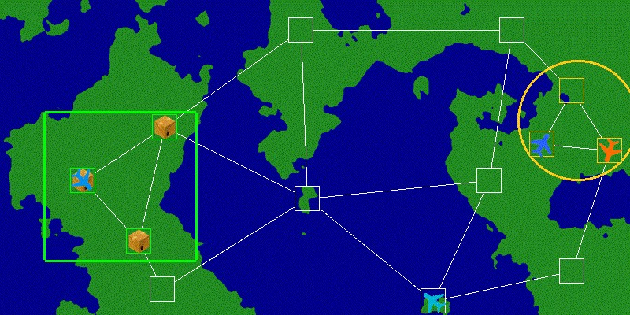

# Announcing the Airlift Challenge Competition
#### Website: https://airliftchallenge.com

The Airlift Challenge seeks improved algorithms to plan and execute airlift operations in the face of dynamic disruptions. Participants compete by submitting OpenAI Gym-based agents that minimize delivery time and cost using reinforcement learning, optimization, heuristics, or any other technique.

## Overview

Airlifts demand the delivery of large sets of cargo into areas of need under tight deadlines. Yet, there are many obstacles preventing timely delivery. Airports have limited capacity to process airplanes, thus limiting throughput and potentially creating bottlenecks. Weather disruptions can cause delays or force airplanes to re-route. Unexpected cargo may be staged for an urgent delivery.

This competition challenges participants to design agents that can plan and execute an airlift operation. Quick decision-making is needed to rapidly adjust plans in the face of disruptions along the delivery routes. The decision-maker will also need to incorporate new cargo delivery requests that appear during the episode. The primary objective is to meet the specified deadlines, with a secondary goal of minimizing cost. Solutions can incorporate machine learning, optimization, path planning heuristics, or any other technique.

## How to Participate
Get started by downloading the starter kit and following the README:
https://github.com/airlift-challenge/airlift-starter-kit
\
More details and documentation can be found at the competition website:
https://airliftchallenge.com/chapters/main.html

Good luck!

## Model
The air network consists of a graph, where nodes are capacity-constrained airports, and edges are routes with an associated cost and time-of-flight. Each cargo item is stored at a node, and must be picked up by agents (airplanes) and delivered to a destination node. Different airplane models can have different route networks. In fact, the network for a specific model may be disconnected, meaning that some airplanes may not be able to reach all airports. Time is needed after an airplane lands to refuel and to load/unload cargo, taking up precious processing capacity at the airport. There are two delivery deadlines: a soft deadline by which the cargo is desired, and a hard deadline after which the delivery is considered missed (with a heavy penalty).

## Interface
The simulation environment is written in Python and follows the PettingZoo multi-agent reinforcement learning interface. An agent issues an action for each airplane, indicating which cargo to load/unload at an airport and which airport to fly to next. The agents observe a number of state variables, including airplane status, cargo locations, route availability, etc… A NetworkX object is provided for each airplane, allowing the agent to easily plan paths using existing library methods. A reward signal generated by the environment penalizes late deliveries, missed deliveries, and movement.

## Scoring and Evaluation

Each episode is assigned a score based on missed deliveries, late deliveries, and total flight cost. This score is normalized against baseline algorithms: participants will receive a score of 0 if they only perform as well as a random agent, and will receive a score of 1 if they perform as well as a simple “shortest path” baseline algorithm. Scores greater than 1 indicate that the algorithm is exceeding the performance of the baselines.

An algorithm will be evaluated over a number of episode scenarios. Scenarios are generated according to a random generative model, with scenarios becoming progressively more difficult. In the beginning stages, there will be one type of airplane which can reach all airports in the air network. Later stages will have specialized airplane types: large aircraft can carry large cargo loads over long distances, but cannot land at small airports located in the drop off area. Instead, they will need to leave cargo at intermediate airports where light aircraft can retrieve the cargo and complete the delivery.

The evaluation will proceed until either:

* the percentage of missed deliveries exceeds a preset threshold, or
* a time limit is reached.

The overall score will be the sum of the normalized scores over all episodes. In addition to performing well on individual episodes, algorithms can also increase their score by completing more episodes.

1. Dimitris Bertsimas, Allison Chang, Velibor V. Mišić, and Nishanth Mundru. The airlift planning problem. Transportation Science, 53(3):773–795, 2019. URL: https://doi.org/10.1287/trsc.2018.0847, doi:10.1287/trsc.2018.0847.

2. Carmen Chiu, Adis Delanovic, Jill Platts, Alexa Loy, and Andre Beckus. A methodology for flattening the command and control problem space. In Artificial Intelligence and Machine Learning for Multi-Domain Operations Applications IV. International Society for Optics and Photonics, SPIE, 2022. URL: https://doi.org/10.1117/12.2615180.

Distribution Statement A: Approved for Public Release; Distribution Unlimited: Case Number: AFRL-2022-5675, CLEARED on 22 Nov 2022
